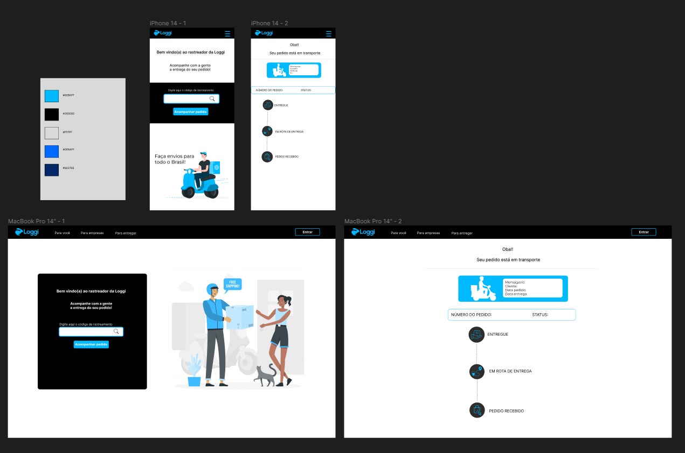

## Frontend Challenge Loggi

 ## Project Summary
This project was developed during Laboratoria's Talent Fest in partnership with Loggi. The main goal was to create a user-friendly and intuitive interface so that users could enter their order number and access the tracking information and the updated status of their order.

 ## Prototype
Before starting the full development of the project, a prototype was created in Figma to visualize the user interaction on the screen and the arrangement of the elements more accurately.

## Project Description
The project was developed using the React library and styled with the help of Material UI. The application has an interface consisting of two main screens:

Main Screen: On this screen, the user has the option to enter their order number in a specific field. After entering the number and clicking on the "Track Order" button, the user is automatically redirected to the tracking page, where they will find key details about their order's progress.

Tracking Page: When the user clicks the button on the main screen, they are redirected to the tracking page. Here, the user can view the current status of the order, who is delivering the package, the expected delivery time, and the route being followed for the product's delivery.

## API mock:
o ensure the efficiency and realism of the route representation, a mock API was specially created for this purpose. This API provides fictitious data, such as the location and status of the order, creating a realistic experience for the user.

## Simulating an Order Tracking

To simulate tracking, simply access the application and enter the order number (1, 2, or 3) in the "Tracking Code" field. After clicking on "Track Order," you will be redirected to the tracking page.

| Pedido                    | Digite |
|------------------------------|:----:|
| Access order tracking 1 | 1 |
| Access order tracking 2| 2 |
| Access order tracking 3 | 3 |

## Developed by: 
Giselle Schwab
